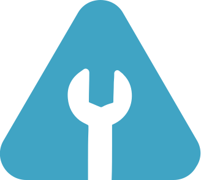

<div>

<!-- PROJECT LOGO -->
<br />
  <div align='center'>
  <a href="https://github.com/No-Country/c14-22-ft-java-react" target="_blank">
    
  </a>
<h3>Bienvenid@s a MechanicAlert</h3></div>
<div>
  <p>
    <strong>Gestor de Servicios Automotrices</strong> es una plataforma web integral que transforma la experiencia de mantenimiento y reparación de vehículos, beneficiando tanto a mecánicos como a usuarios. Con un enfoque en la transparencia, eficiencia y ahorro de tiempo, esta plataforma redefine la gestión de servicios automotrices, 
  </p>
    <div align='center'>
    <a href="https://mechanicalert-frontend.vercel.app/" target="_blank">
          
       </a>
   <a href="https://documenter.getpostman.com/view/28499711/2s9YeHarB3#34be9a3d-0b89-410d-9d06-e7c04ff8a133" target="_blank">
          
      </a>
    <a href="https://www.figma.com/file/tM2dKlHxEoRhvYXlOs2ZHa/s12-09-ft-node-react?type=design&node-id=393-13144&mode=design&t=30WtGr9EDH3hcngN-0" target="_blank">
          
      </a>
      <a href="https://github.com/No-Country/s12-09-ft-node-react/issues" target="_blank">
          
      </a>
      </div>
</div>
<!-- ABOUT THE PROJECT -->
<br>
<h1> 

Acerca del Proyecto
</h1>
MechanicAlert es un <b>Gestor de Servicios</b>. Esta inovadora plataforma no solo simplifica la vida de los mecánicos al permitirles registrar fácilmente detalles de arreglos y gestionar inventarios, sino que también mejora tu experiencia como usuario al proporcionarte un acceso sin complicaciones a un historial detallado de servicios y recordatorios personalizados. Además, ofrecemos características extraordinarias como presupuestos en línea, seguimiento en tiempo real de las reparaciones y notificaciones multicanal para mantenerte siempre informado.MechanicAlert garantiza comodidad y seguridad tanto al cliente como al mecanico.

¿Imaginas tener toda esta potencia al alcance de tu mano? También estamos desarrollando aplicaciones móviles para brindarte acceso instantáneo y conveniente desde cualquier lugar.

En resumen, nuestro Gestor de Servicios Automotrices no solo es una plataforma, ¡es una revolución en la forma en que cuidamos de nuestros vehículos! ¡Únete a nosotros y experimenta el futuro hoy mismo!

<br/>
<h1> Tecnologias Usadas !REVISAR!
</h1>
<h3>Front-End</h3>


<h3>Back-End</h3>


<!--  -->

<!--

 -->

<h3>Base de datos</h3>


<h3>QA</h3>


<!-- Organización -->
<h1> Organización
</h1>
  
  


<!-- GETTING STARTED -->
<h1> Comenzando
</h1>

Para instalar el proyecto localmente:

Clonar repositorio

```sh
git clone https://github.com/No-Country/s12-09-ft-node-react.git
```

Instalar dependencias

```sh
cd .\frontend\ | npm install
```

Correr el proyecto

```sh
npm run dev
```

O simplemente clickea en el link de
<a href="https://mechanicalert-frontend.vercel.app/" target="_blank">Ver Demo.</a>

<!-- USAGE EXAMPLES -->
<h1> Uso !REVISAR!
</h1>

Puedes comenzar registrandote en nuestro portal, luego podras iniciar sesion y a partir de alli podras gestionar todo tu negocio con control de productos, seguimineto de las transacciones internas de la empresa y recepcion de notificaiones y alertas correspondientes.

<!-- TEAMS -->

<h1> Equipo ( s12-09-ft-node-react )
</h1>

<table align='center'>
  <tr>
    <td align='center'>
      <div >
        <a href="https://github.com/alejoaraya" target="_blank" rel="author">
          
        </a>
        <a href="https://github.com/alejoaraya" target="_blank" rel="author">
          <h4 style="margin-top: 1rem;">Alejo Araya</br><small>Front-End</small></h4>
        </a>
        <div style='display: flex; flex-direction: column'>
        <a href="https://github.com/alejoaraya" target="_blank">
          
        </a>
        <a href="https://www.linkedin.com/in/alejoaraya/" target="_blank">
          
        </a>
        </div>
      </div>
    </td>
    <td align='center'>
      <div >
        <a href="https://github.com/jooseariias" target="_blank" rel="author">
          
        </a>
        <a href="https://github.com/jooseariias" target="_blank" rel="author">
          <h4 style="margin-top: 1rem;">Joose Arias</br><small>Front-End</small></h4>
        </a>
        <div style='display: flex; flex-direction: column'>
        <a href="https://github.com/jooseariias" target="_blank">
          
        </a>
        <a href="https://www.linkedin.com/in/joose-ari-b08729233/" target="_blank">
          
        </a>
        </div>
      </div>
    </td>
    <td align='center'>
      <div >
        <a href="https://github.com/Alvarordev" target="_blank" rel="author">
          
        </a>
        <a href="https://github.com/Alvarordev" target="_blank" rel="author">
          <h4 style="margin-top: 1rem;;">Alvaro Rodriguez</br><small>Front-End</small></h4>
        </a>
        <div style='display: flex; flex-direction: column'>
        <a href="https://github.com/Alvarordev" target="_blank">
          
        </a>
        <a href="https://www.linkedin.com/in/luisangelsalcedo/" target="_blank">
          
        </a>
        </div>
      </div>
    </td>
    </tr>
    <tr>
    <td align='center'>
      <div >
        <a href="https://github.com/JoaquinHAcosta" target="_blank" rel="author">
          
        </a>
        <a href="https://github.com/JoaquinHAcosta" target="_blank" rel="author">
          <h4 style="margin-top: 1rem;">Joaquin Acosta</br><small>Front-End</small></h4>
        </a>
        <div style='display: flex; flex-direction: column'>
        <a href="https://github.com/JoaquinHAcosta" target="_blank">
          
        </a>
        <a href="https://www.linkedin.com/in/luisangelsalcedo/" target="_blank">
          
        </a>
        </div>
      </div>
    </td>
    <td align='center'>
      <div >
        <a href="https://github.com/luisangelsalcedo" target="_blank" rel="author">
          
        </a>
        <a href="https://github.com/luisangelsalcedo" target="_blank" rel="author">
          <h4 style="margin-top: 1rem;">Luis Salcedo</br><small>Front-End</small></h4>
        </a>
        <div style='display: flex; flex-direction: column'>
        <a href="https://github.com/luisangelsalcedo" target="_blank">
          
        </a>
        <a href="https://www.linkedin.com/in/luisangelsalcedo/" target="_blank">
          
        </a>
        </div>
      </div>
    </td>
  </tr>
  </table>
  <table align='center'>
<tr>
<td align='center'>
      <div >
        <a href="https://github.com/Dac1977" target="_blank" rel="author">
          
        </a>
        <a href="https://github.com/Dac1977" target="_blank" rel="author">
          <h4 style="margin-top: 1rem;">Diego Castillo</br><small>Back-End</small></h4>
        </a>
        <div style='display: flex; flex-direction: column'>
        <a href="https://github.com/Dac1977" target="_blank">
          
        </a>
        <a href="https://www.linkedin.com/in/cristianhof" target="_blank">
          
        </a>
        </div>
      </div>
    </td>
<td align='center'>
      <div >
        <a href="https://github.com/EmmanuelML78" target="_blank" rel="author">
          
        </a>
        <a href="https://github.com/EmmanuelML78" target="_blank" rel="author">
          <h4 style="margin-top: 1rem;">Emmanuel Medina</br><small>Back-End</small></h4>
        </a>
        <div style='display: flex; flex-direction: column'>
        <a href="https://github.com/EmmanuelML78" target="_blank">
          
        </a>
        <a href="https://www.linkedin.com/in/faviofernandez/" target="_blank">
          
        </a>
        </div>
      </div>
    </td>
<td align='center'>
      <div >
        <a href="https://github.com/YordanPZ" target="_blank" rel="author">
          
        </a>
        <a href="https://github.com/YordanPZ" target="_blank" rel="author">
          <h4 style="margin-top: 1rem;">Yordani Jimenez</br><small>Back-End</small></h4>
        </a>
        <div style='display: flex; flex-direction: column'>
        <a href="https://github.com/YordanPZ" target="_blank">
          
        </a>
        <a href="https://www.linkedin.com/in/faviofernandez/" target="_blank">
          
        </a>
        </div>
      </div>
    </td>
  
</tr>
</table>
<table align='center'>
  <tr>
<td align='center'>
      <div >
        <a href="https://github.com/MRobertaMendoza" target="_blank" rel="author">
          
        </a>
        <a href="https://github.com/MRobertaMendoza" target="_blank" rel="author">
          <h4 style="margin-top: 1rem;">Roberta Mendoza</br><small>QA</small></h4>
        </a>
        <div style='display: flex; flex-direction: column; width: 100%'>
        <a href="https://github.com/MRobertaMendoza" target="_blank">
          
        </a>
        <a href="https://www.linkedin.com/in/alvaro-deveze/" target="_blank">
          
        </a>
        </div>
      </div>
    </td>
    <td align='center'>
      <div >
        <a href="https://github.com/PaoBasQA" target="_blank" rel="author">
          
        </a>
        <a href="https://github.com/PaoBasQA" target="_blank" rel="author">
          <h4 style="margin-top: 1rem;">Paola Bastida</br><small>QA</small></h4>
        </a>
        <div style='display: flex; flex-direction: column'>
        <a href="https://github.com/PaoBasQA" target="_blank">
          
        </a>
        <a href="https://www.linkedin.com/in/melina-delosangeles-valdez/" target="_blank">
          
        </a>
        </div>
      </div>
    </td>
    </tr>
</table>

<!-- Video -->
<!-- <h1> Video
</h1>
<p><a href="https://www.youtube.com/watch?v=QVgfj7hjp8g" target="_blank"></a></p> -->
<!-- <br/> -->

<!-- ACKNOWLEDGMENTS -->

<div align='center'>
<h3>Agradecimientos</h3>
  <a href="https://www.nocountry.tech/" target="_blank">
    
  </a>
</div>
